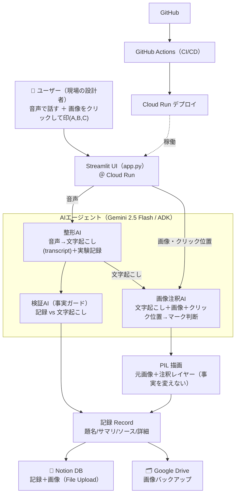

# しゃべれぽAI アーキテクチャ

音声で話す＋画像に印 → AIが整形・検証・注釈 → Notionに資産化。

## 構成要素
| 層 | 技術 | 役割 |
|---|---|---|
| UI | Streamlit（Cloud Run） | 音声録音・画像アップ/クリック・プレビュー・承認 |
| 整形AI | Gemini 2.5 Flash（音声入力） | 音声→文字起こし＋実験フォーマット |
| 検証AI | Gemini（structured output） | 事実改変の検出（ソース vs 記録） |
| 画像注釈AI | Gemini（画像理解） | **整形AIの文字起こし(transcript)** ＋画像＋クリック位置から注釈を設計、描画はPIL（音声は再処理しない） |
| 保存 | Notion API（File Upload）／Drive API | 記録＋画像の資産化／バックアップ |
| 基盤 | Cloud Run ／ GitHub Actions | デプロイ先 ／ CI/CD |

## 設計の軸
- **事実を変えない**：音声＝要約方向（リスク低）／画像＝元画像保持のオーバーレイ（生成AIで作り変えない）
- **ユーザーは喋るだけ**：工数・ストレス最小
- **差別化**：実験特化フォーマット ＋ 現場マルチモーダル（画像注釈・音声で特定）＋ Notion資産化
