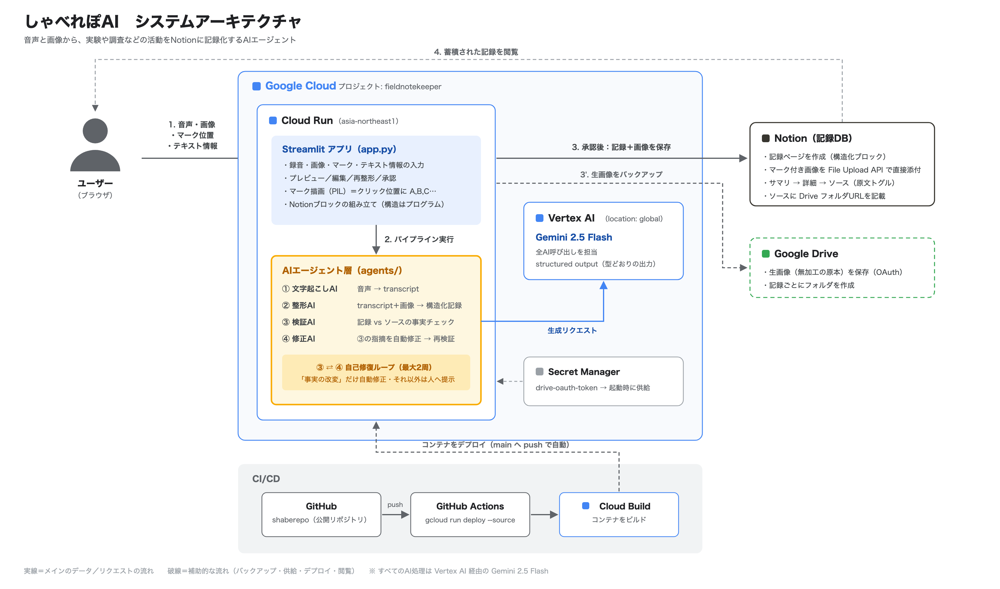
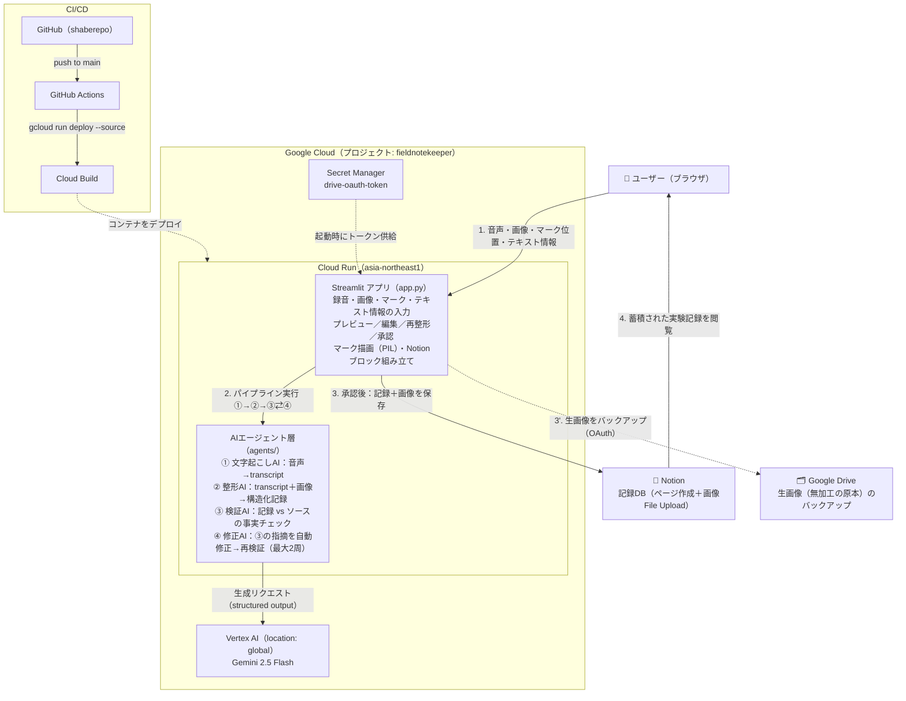

# しゃべれぽAI アーキテクチャ

音声と画像から、実験や調査などの活動をNotionに記録化するAIエージェント。
（音声で話す＋画像にマーク → AIが整形・検証・自己修復 → 人が承認 → Notionへ保存）

## 構成要素
| 層 | 技術 | 役割 |
|---|---|---|
| UI | Streamlit（Cloud Run・asia-northeast1） | 録音・画像アップ／マーク・プレビュー・編集・承認。マークはクリック位置にPILが描画（AI関与なし） |
| ① 文字起こしAI | Gemini 2.5 Flash（音声） | 音声→transcript（段落分けのみ） |
| ② 整形AI | Gemini 2.5 Flash（マルチモーダル・structured output） | transcript＋画像＋テンプレ→構造化記録（スキーマの穴埋めのみ。構造はプログラムが組む） |
| ③ 検証AI | Gemini 2.5 Flash（structured output） | 記録 vs ソースの事実チェック（改変／推測の追加／欠落） |
| ④ 修正AI | Gemini 2.5 Flash（structured output） | 「事実の改変」だけ自動修正→③再検証（自己修復ループ・最大2周） |
| AI基盤 | Vertex AI（location: global） | 全AI呼び出しの実行基盤 |
| 保存 | Notion API（File Upload）／Drive API（OAuth） | 記録＋マーク付き画像の資産化（ソースにDriveフォルダURLを記載）／生画像（無加工原本）のバックアップ |
| 基盤 | Cloud Run／Secret Manager／GitHub Actions＋Cloud Build | 実行環境／Driveトークン供給／CI/CD（main pushで自動デプロイ） |

## 設計の軸
- **事実を変えない**：検証AI＋自己修復ループが事実の改変を機械的に排除。画像は元画像保持のオーバーレイ（生成AIで作り変えない）
- **ユーザーは喋るだけ**：工数・ストレス最小。マークの意味も音声で説明するだけ
- **構造はプログラム、中身はAI**：AIはstructured outputで型の穴埋めのみ。記法・階層・Notionブロックはプログラムが組む（出力の暴れを構造的に防ぐ）
